# Minimal AWS bootstrap and GitOps activation

Use this runbook only after a reviewed Terraform plan is approved. The
foundation creates billable AWS resources and must run from a short-lived,
MFA-backed operator session. Never place AWS access keys or application secret
values in GitHub, Terraform variables, plans, state, or Git.

The Phase 1 footprint is deliberately limited to staging and production in
`us-east-1`. Each environment has one EKS cluster, one active worker-node AZ,
one NAT gateway, one runtime secret, CloudFront, and an ALB. The ALB
uses two public subnets because AWS requires it, but all application targets
run in the primary private subnet. A primary-AZ outage causes application
downtime; this is an accepted cost/reliability trade-off, not HA.

See [the rendered architecture diagram](../architecture/aws-minimal.svg) and
[its Mermaid source](../architecture/aws-minimal.mmd).



## Prerequisites

- One shared-services AWS account and isolated staging and production accounts.
- One owned domain. Delegate `staging.<domain>` to the staging account and keep
  the production application zone in the production account.
- Terraform, AWS CLI, Helm, and kubectl installed locally.
- MFA-backed roles that can apply the reviewed shared and environment plans.

## 1. Bootstrap shared services

Copy `infra/terraform/bootstrap/shared/terraform.tfvars.example` to ignored
`terraform.tfvars`, replace the account IDs, and authenticate to the shared
services account. Review the exact plan before applying it:

```bash
terraform -chdir=infra/terraform/bootstrap/shared init
terraform -chdir=infra/terraform/bootstrap/shared plan -out=shared.tfplan
terraform -chdir=infra/terraform/bootstrap/shared show shared.tfplan
```

After explicit approval, apply exactly the saved plan. Configure these
repository variables from its outputs:

- `AWS_SHARED_REGION=us-east-1`
- `AWS_BUILD_ROLE_ARN`
- `AWS_PROMOTION_ROLE_ARN`
- `NEXT_PUBLIC_SUPABASE_URL`
- `NEXT_PUBLIC_SUPABASE_ANON_KEY`

## 2. Provision staging, then production

Copy the checked-in staging examples to ignored local files, replace every
placeholder with shared bootstrap outputs, account ID, Route 53 zone, and
approved operator CIDRs. Run:

```bash
terraform -chdir=infra/terraform/environments/staging init \
  -backend-config=backend.hcl
terraform -chdir=infra/terraform/environments/staging plan \
  -out=staging.tfplan
terraform -chdir=infra/terraform/environments/staging show staging.tfplan
```

Apply only the reviewed saved plan. Do not provision production until staging
has passed deployment, authentication, provider, and rollback checks. Restrict
EKS API access to the approved operator network before cluster bootstrap.

## 3. Supply the one runtime secret

Terraform creates one empty Secrets Manager container named `legacy-next` per
environment. Over an audited, short-lived session, supply these keys:

- `NEXT_PUBLIC_SUPABASE_URL`
- `NEXT_PUBLIC_SUPABASE_ANON_KEY`
- `ALPACA_API_KEY`
- `ALPACA_SECRET_KEY`
- `GEMINI_API_KEY`

Do not print the payload or capture it in shell history. Confirm the legacy
workload role can read only this secret.

## 4. Bootstrap GitOps

Replace account-specific placeholders in
`infra/helm/indus-applications/values-<environment>.yaml` and
`infra/gitops/environments/<environment>/legacy-next.yaml` with Terraform
outputs. Leave the zero digest until the release workflow opens its first
promotion PR.

```bash
aws eks update-kubeconfig --region us-east-1 --name indus-staging
kubectl apply -f infra/gitops/bootstrap/namespaces.yaml
helm repo add argo https://argoproj.github.io/argo-helm
helm repo update argo
helm upgrade --install argocd argo/argo-cd \
  --version 10.9.1 --namespace argocd --wait --timeout 10m
kubectl apply -f infra/gitops/bootstrap/staging.yaml
```

Verify Argo CD applications are healthy before promotion. Only the current
Next.js workload and required add-ons run in Phase 1.

## 5. Release, cut over, and roll back

Every relevant push to `main` builds, scans, signs, attests, and publishes one
immutable image, then opens a staging digest-promotion PR. Merge that PR only
after checks pass; Argo CD reconciles the exact digest. Promote the same digest
to production through the manual `Promote AWS legacy image` workflow.

Production starts with Route 53 sending 0% traffic to AWS and 100% to Vercel.
Increase `aws_traffic_weight` only after CloudFront, ALB target health,
authenticated browser checks, and accessibility smoke tests pass. Roll back by
restoring the prior signed digest or by returning the DNS weight to Vercel.

Do not retire Vercel, the prior image, or the secret until the rollback window
closes.
