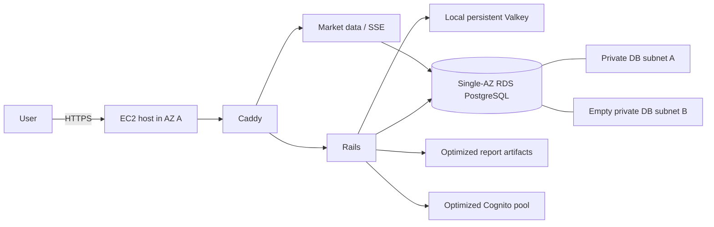

# Optimized AWS deployment

## Purpose and topology

The optimized profile is a separate AWS configuration for evaluating the same
Indus application at a much smaller footprint. It does not alter or share
Terraform ownership with the existing main profile.

The EC2 host runs in a public subnet in AZ A with an Elastic IP and only ports
80 and 443 open. RDS is private in AZ A and accepts PostgreSQL only from the
host security group. A private subnet in AZ B is a member of the RDS subnet
group but has no running resource, no NAT, and no standby. The subnet itself
does not have a separate hourly cost. The topology has a single application
host and a single database instance, so either host failure or AZ A failure
interrupts service.

## Bootstrap and provision

1. Create GitHub Environments named `optimized-production-plan` and
   `optimized-production`, both restricted to `main`. Require human approval
   on `optimized-production`. Create the GitHub OIDC provider at the account
   boundary if it does not already exist.
2. Copy `infra/optimized/terraform/bootstrap/terraform.tfvars.example` to its
   ignored counterpart. Supply the account ID and operator-supplied OIDC provider
   ARN. Run `terraform init`, save and review `terraform plan`, then apply only
   with explicit authorization. The bootstrap state begins locally because it
   creates the backend.
3. Migrate the reviewed bootstrap state into the new optimized state bucket.
   Record the bucket, KMS key, optimized ECR repositories, Terraform role, and
   release role. Do not reuse main's state bucket or state key.
4. Copy the environment backend and variables examples to ignored files. Select
   a VPC CIDR that does not overlap main, an independent preview hostname, two
   AZs, and optimized bootstrap ECR ARNs. Use the second RDS subnet for the DB
   subnet group only. Review the saved plan before apply. The environment
   creates an optimized-owned hosted zone for that hostname; a domain owner
   must add its NS delegation in the parent zone separately. Do not point a
   main production hostname at this profile.
5. Put the base64-encoded ignored backend and variable files in both
   environments as `OPTIMIZED_TF_BACKEND_CONFIG_B64` and
   `OPTIMIZED_TF_VARS_B64`. Set `OPTIMIZED_AWS_REGION` in both, and set the
   optimized plan and apply role ARNs as `OPTIMIZED_PLAN_ROLE_ARN` and
   `OPTIMIZED_TERRAFORM_ROLE_ARN` respectively. Dispatch the manual
   `optimized-infrastructure` workflow from `main`. `plan` only reviews;
   `apply` first saves an exact plan, publishes its readable form in the job
   summary, then waits for approval of `optimized-production` before applying
   that saved plan. Both jobs require the optimized state bucket and key.

The optimized web image uses the same `/auth` confirmation and recovery
experience as the main application: signup codes, recoverable unconfirmed
accounts, resend cooldowns, and password-reset codes. Cognito MFA remains off.
The optimized pool has its own users and issuer; it does not inherit main-pool
accounts.

`enable_branded_cognito_email` defaults to `false`. Setting it to `true` in the
private optimized Terraform variables configures Cognito to send the Indus HTML
verification template through SES and creates the SES identity and DKIM records
in the optimized hosted zone. Before enabling it, delegate that hosted zone in
public DNS and confirm SES can send to arbitrary recipients in this region. SES
may otherwise remain in its sandbox, where signup delivery is restricted. Keep
the flag false until those prerequisites are ready; Cognito's standard sender
continues to work meanwhile.

The optimized bootstrap creates its own plan, apply, release, and host IAM
roles. These are roles in the configured AWS account, not new human IAM users.
An existing MFA-backed operator identity with permission to bootstrap the
optimized stack can be reused. The account-level GitHub OIDC provider can also
be reused if it already exists; the optimized workflow still needs its own
GitHub environment approvals and role ARN variables.

Terraform creates secret containers only. Add runtime secret values through an
audited operator session. Do not place database, Alpaca, Gemini, Temporal, or
Cognito migration values in Terraform, user data, source, workflow output, or
release manifests.

Create a least-privilege PostgreSQL runtime role from an audited operator
session using the RDS-managed master secret. Give it only the database and
schema privileges needed by the Rails and Rust migrations and runtime; store
its TLS-required `DATABASE_URL` in each relevant optimized runtime secret.
Each secret value must be a Docker env-file payload with one `KEY=value` entry
per line. Keep the optimized Cognito issuer, client, UserInfo URL, web origin,
artifact bucket, Temporal Cloud configuration, and model provider configuration
in the appropriate service secret. Set `MARKET_JWKS_URL`,
`MARKET_JWT_ISSUER`, `MARKET_JWT_AUDIENCE`, `MARKET_ALLOWED_ORIGINS`, and
Alpaca credentials for market data. Never set Kafka or ElastiCache IAM
variables in this profile. Rotate a value in Secrets Manager and restart the
optimized systemd service to refresh its root-owned `/run` secret files.

## First release and operations

Set the optimized public browser variables from the optimized environment
outputs: `OPTIMIZED_WEB_ORIGIN`, `OPTIMIZED_COGNITO_AUTHORITY`, and
`OPTIMIZED_COGNITO_CLIENT_ID`. Configure the optimized instance ID and the
three runtime secret ARNs as non-secret GitHub Environment variables. The
release role is restricted to optimized ECR and tagged SSM targets.

Dispatch `optimized-application` with `publish`. It scans and pushes immutable
images, then opens a pull request that changes only
`infra/optimized/releases/production.env`. Review and merge that digest manifest.
Dispatch it with `deploy` from `main` only after that merge. The host fetches
its own secret values with its instance profile; the workflow never receives
them. The deployment checks digest pinning, pulls images, runs exactly one
Rails migration job, starts workers and market data, then starts Caddy.

The host uses Systems Manager; there is no SSH access. Caddy terminates HTTPS,
serves the SPA, proxies `/api` to Rails, and proxies `/stream` to Rust with
SSE buffering disabled. The Valkey AOF volume sits on the encrypted EBS volume.
An abrupt host loss can lose recent queue work; do not represent it as a durable
replacement for a separate managed cache.
The AL2023 AMI provides AWS CLI v2, while bootstrap installs Docker and a
checksum-verified Compose plugin. The systemd service refreshes secrets on
reboot before starting containers. Review the saved prior manifest at
`/opt/indus-optimized/previous-release.env` before a rollback. A failed new
release restores those prior image digests, but does not reverse a database
migration.

Before the first Caddy start, make the delegated preview DNS name resolve to
the optimized Elastic IP and leave port 80 reachable so ACME can issue its
certificate. Caddy redirects HTTP to HTTPS after issuance and renews the
certificate while the hostname and port 80 remain reachable. Verify Rails
`/readyz`, Rust `/health/ready`, authenticated `/api/v1/...`, and an
authenticated `/stream/v1/streams/AAPL` connection after a separately
authorized deployment; repeat with a slash-delimited crypto symbol and a
reconnect cursor.

For image rollback, restore a prior reviewed manifest and dispatch `deploy`.
Schema migrations are forward-only: an image rollback must remain compatible
with the migrated schema. For host recovery, replace the instance through a
reviewed Terraform plan, restore runtime configuration and secrets, then test
health before restoring DNS. Restore RDS from a tested backup when data repair
is required.

## Identity and data migration before any cutover

Provisioning optimized does not migrate existing users. Its Cognito pool has a
different issuer and subjects, while Rails ownership is keyed by `(issuer,
external_subject)`. Switching DNS before a deliberate identity migration would
give returning users new Rails identities and hide their existing records.

A separate cutover change must inventory source and destination accounts,
verify a migration mapping without trusting an email claim alone, preserve each
Rails `users.id`, handle duplicates and incomplete signups, make retries
idempotent, create audit records, and define a rollback. Cognito's user
migration trigger can retain passwords on first sign-in only while it can
authenticate against the existing directory. A bulk import does not preserve
ordinary Cognito passwords automatically.

That later change must also preflight extensions, schema, storage, connection
capacity, and source data; pause writes/workers; take a recovery point; perform
a rehearsed logical Aurora-to-RDS export/restore; preserve UUIDs and migration
history; compare row counts and ownership; transfer required artifacts; and run
authentication, reports, watchlist, chart, SSE, and recovery checks. Once
optimized accepts writes, a DNS-only rollback is unsafe without reconciling the
two databases.

## Capacity, cost, and monitoring

The starting `t3a.medium` and `db.t4g.small` values are candidates, not proven
capacity. Measure memory, CPU credits, disk, database connections, latency,
market ingestion, and Sidekiq backlog under a representative load before
cutover. The current process set does not support a 2-GiB host assumption.

Budget for EC2 and any burst credits, EBS, public IPv4, RDS compute/storage/
backups/I/O, S3, Cognito and optional SES, ECR, KMS/Secrets Manager, Route 53,
CloudWatch, data transfer, and overlap with main. The profile intentionally
omits the large recurring EKS, Aurora, Proxy, MSK, ElastiCache, ALB, CloudFront,
and NAT charges. It creates alarms for EC2 status, memory and disk pressure,
RDS CPU, storage and connections, RDS backup/failure events, HTTPS readiness,
and a tagged budget. Confirm SNS email subscriptions and alarm delivery during
a separately authorized activation; pending email confirmations receive no alerts.
